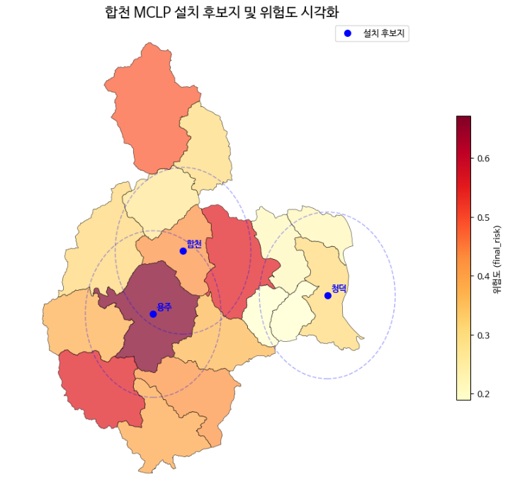

# 경상남도 빅데이터 분석 프로젝트
**산불 방지를 위한 소방방재시설 최적 입지 선정**

경상남도 빅데이터분석 공모전에 제출한 프로젝트로, 산불 발생 위험을 최소화하기 위해 소방방재시설의 최적 입지를 선정하는 분석을 수행했습니다.

## 목차
- [소개](#소개)
- [프로젝트 목표](#프로젝트-목표)
- [데이터](#데이터)
- [분석 방법](#분석-방법)
- [결과](#결과)
- [기술 스택](#기술-스택)

## 소개
경상남도 내 산불 위험 지역을 분석하여, 소방방재시설을 효율적으로 배치할 수 있는 최적의 입지를 선정합니다.  
공공 데이터와 지리정보 데이터를 활용하여 분석과 시각화를 수행하였습니다.

## 프로젝트 목표
- 산불 발생 가능성이 높은 지역 파악
- 최적 소방방재시설 입지 선정
- 공간적 효율성을 고려한 시뮬레이션

## 데이터
- 산불 발생 기록 (공공데이터)
- 산림 데이터
- 소방시설 위치 정보
- 기상 데이터
- 행정구역좌표 데이터  

## 분석 방법
1. 데이터 전처리 및 통합
2. GIS 기반 공간 분석
3. 산불 위험 점수 계산
4. 위험도 기준 클러스터링
5. 최적 입지 선정 (최적화 모델)
6. 결과 시각화 및 보고

## 결과
- 위험도 지도 시각화
- 추천 소방방재시설 위치 지도
- 분석 보고서 제공

